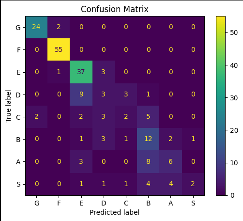

# Pokémon Strength Classifier
 
A machine learning project that predicts **Pokémon competitive strength tiers** from combat statistics, with an evaluation of whether AI-assisted hyperparameter suggestions genuinely improve model performance.
 
## Table of Contents
 
- [Introduction](#introduction)
- [Installation](#installation)
- [Dataset](#dataset)
- [Project Structure](#project-structure)
- [Machine Learning Approach](#machine-learning-approach)
- [Error Analysis](#error-analysis)
- [AI-Assisted Improvement](#ai-assisted-improvement)
- [Results](#results)
- [Conclusion](#conclusion)
 
## Introduction
 
In competitive Pokémon, players categorize Pokémon into **strength tiers** — from weakest to most dominant — based on their battle performance. This project attempts to automate tier prediction using only numerical combat statistics via a neural network classifier.
 
Beyond building the classifier itself, this project investigates a meta-question:
 
> *Can an AI assistant reliably suggest hyperparameter improvements to a machine learning model?*

## Installation

```bash
git clone https://github.com/kinoss123/Pokemon-strength-classifier.git
cd Pokemon-strength-classifier
```
 
**Install dependencies:**
 
```bash
pip install pandas numpy matplotlib seaborn scikit-learn
```
 
*(Optional — required only for `CheckAccuraccy.py` and `AISugeestion.py`):*
 
```bash
pip install groq
```
 
**Launch the notebook:**
 
```bash
jupyter notebook pokemon_strength_classifier.ipynb
```

## Dataset

The project uses our modified version of [Pokémon database](https://www.kaggle.com/datasets/mrdew25/pokemon-database) containing:

* **202 Pokémon**
* **7 combat-related numerical features**
* **8 target classes (tiers)**

### Input Features

| Feature               | Description                 |
| --------------------- | --------------------------- |
| HP                    | Health points               |
| Attack                | Physical attack power       |
| Defense               | Physical defense capability |
| Sp. Attack            | Special attack strength     |
| Sp. Defense           | Special defense capability  |
| Speed                 | Determines turn order       |
| Base Stat Total (BST) | Sum of all base stats       |

### Target Variable

Pokémon are classified into **8 strength tiers**:

```

G → F → E → D → C → B → A → S
Weak ---------------- Strong
```

### Data Preprocessing

1. **Data cleaning**

   * Missing values handled
   * Labels standardized

2. **Train/Dev/Test split**

   * Used for fair model evaluation

3. **Dimension Reduction**

   * Applied using `Principal Component Analysis`

## Project Structure
 
```
Pokemon-strength-classifier/
├── pokemon_strength_classifier.ipynb   # Main notebook (baseline + PCA models)
├── CheckAccuraccy.py                   # Trains model and calls Groq for hyperparameter suggestions
├── AISugeestion.py                     # Trains model and calls Groq for qualitative analysis
├── PokemonDatabase.csv                 # Dataset
├── test_results/
│   ├── standard_predictions.csv        # Test predictions from the standard model
│   └── pca_predictions.csv             # Test predictions from the PCA model
└── README.md
```

## Machine Learning Approach

### Pipeline

```
Dataset
   ↓
Data Cleaning & Label Encoding
   ↓
Train / Dev / Test Split (stratified)
   ↓
Feature Scaling (StandardScaler)
   ↓
          ┌──────────────────────────────┐
          │                              │
   Standard Features              PCA (n=2 components)
          │                              │
   MLPClassifier                  MLPClassifier
  (hidden=(10,))                (hidden=(100,))
          │                              │
   Evaluation                     Evaluation
          └──────────────────────────────┘
```

### Baseline Model — Standard Pipeline
 
```python
MLPClassifier(
    hidden_layer_sizes=(10,),
    activation="relu",
    alpha=0.1,
    max_iter=1000,
    random_state=42
)
```
 
### Experimental Model — PCA Pipeline
 
```python
PCA(n_components=2)

MLPClassifier(
    hidden_layer_sizes=(100,),
    activation="relu",
    alpha=0.0001,
    max_iter=500,
    random_state=42
)
```
 
PCA reduces the 7 input features down to 2 principal components, enabling decision boundary visualization while also testing whether dimensionality reduction helps or hurts performance on this dataset.
 
We chose `MLPClassifier` because:
- It can learn nonlinear relationships between stats
- Pokémon stat combinations may interact in complex, non-linear ways
- It provides a strong and flexible baseline for multi-class classification

## Error Analysis

### Confusion Matrix



Several limitations affected performance.

### 1. Class Imbalance

Some tiers contain very few Pokémon samples. Rare tiers (e.g., `G`, `S`) are underrepresented, making it harder for the model to learn their boundaries.

### 2. Missing Features

The model lacks access to information that competitive players consider critical:
 
- Pokémon Type (e.g., Water, Psychic)
- Abilities (e.g., Speed Boost, Intimidate)
- Legendary / Mythical status
- Evolution stage
- Held item / competitive move pool

### 3. Small Dataset Size

Only **202 Pokémon** were included.

This limits the model’s ability to generalize.

### 4. Overlapping Statistics

Many Pokémon share similar stat distributions despite different rankings.

## AI-Assisted Improvement

To evaluate the usefulness of AI, we asked an AI assistant:

> *"How can we improve our Pokémon classifier?"*

The suggested modification:

```text
10 hidden neurons
↓
50 hidden neurons
```

## Results

### Baseline Model

| Metric               | Result |
| -------------------- | ------ |
| Train Accuracy       | ~74%   |
| Development Accuracy | ~70%   |

### AI-Assisted Version

| Metric               | Result  |
| -------------------- | ------- |
| Train Accuracy       | ~81%    |
| Development Accuracy | ~63–70% |

### Key Finding

Although the AI-assisted model achieved **higher training accuracy**, it did **not consistently improve development performance**.
This indicates **overfitting**.
The larger model learned training examples more effectively but generalized worse to unseen Pokémon.

### Helped

✔ Suggested alternative approaches
✔ Encouraged experimentation
✔ Assisted interpretation of results

### Misled

⚠ Suggested a larger neural network that increased overfitting
⚠ Higher train accuracy initially appeared misleading

### Final Reflection

> **AI is useful for generating hypotheses, but human validation remains essential.**
Not every AI suggestion improves performance.
Experiments and evaluation are still necessary.

## Conclusion

This project demonstrates that machine learning can learn meaningful patterns from Pokémon combat statistics and partially predict competitive strength tiers. However, raw stats alone are insufficient for perfect classification — competitive viability is shaped by many factors that numbers cannot fully capture.
 
More broadly, this project shows that:
 
> **Good machine learning is not only about achieving high accuracy, but also about understanding model limitations and validating assumptions.**
 
AI assistance proved valuable for generating ideas and interpreting results, but experimentation remained necessary to distinguish genuinely helpful suggestions from misleading ones.

